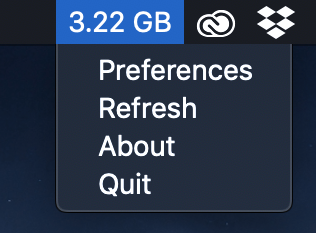
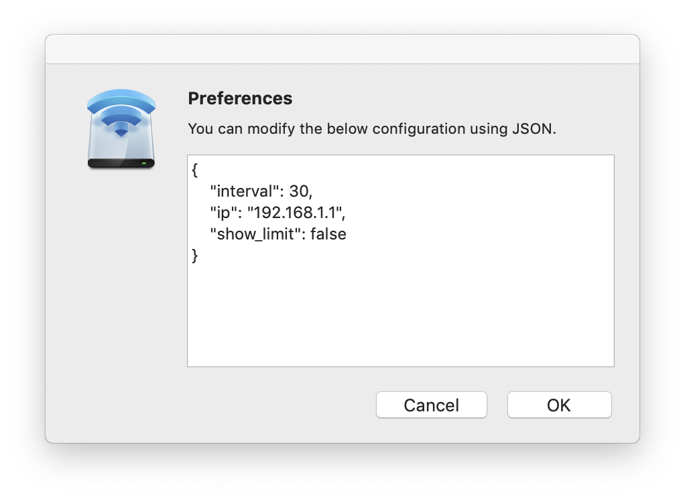

# HuaweiMeter
Mac Status Bar app and CLI tool to show current data usage from from the Huawei Mobile WiFi router's API.

## Install
Download the latest version from [https://github.com/christiandt/HuaweiMeter/releases](https://github.com/christiandt/HuaweiMeter/releases). 

Unzip and move `HuaweiMeter.app` to the Applications folder of your computer.

## Gotchas
The software will read data-cap from the API, and will only really work on GB usage, but can easily be adapted to count MB instead. Code is hacked together on vacation, expect stuff to break.

## UI Windows

## CLI version / Development Environment:
To download necessary requirements, run the make command:

    make

To run the meter, simply run the make run command:

    make run

You can provide an integer as argument to specify the update interval. Data will be fetched from the API of the router, so only local connections will be made, and thus not incur traffic on your mobile connection.

	make run update=10

This will set an update interval of 10 seconds. The default IP for the router API is set to 192.168.0.1, the default IP of the Huawei mobile routers. If you have changed this, you need to provide the IP to the GigReader object.

## Example Output:

[██████████████████████████████████████████------------------] 6.99 GB / 10.0 GB